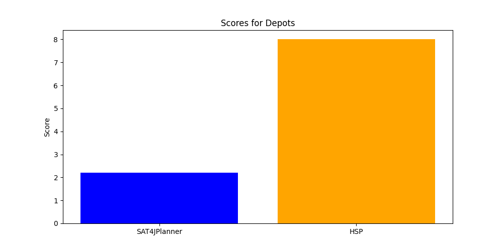
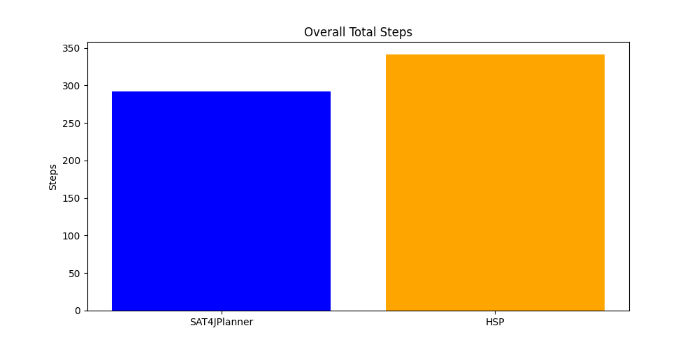

# Comparison of SAT4JPlanner and HSP

| Solver       | Problem                            | Time Spent (s) | Steps |
|--------------|------------------------------------|----------------|-------|
| SAT4JPlanner | ./pddl/logistics/problems/p01.pddl | 0.25           | 31    |
| HSP          | ./pddl/logistics/problems/p01.pddl | 0.17           | 20    |
| SAT4JPlanner | ./pddl/logistics/problems/p02.pddl | 0.22           | 29    |
| HSP          | ./pddl/logistics/problems/p02.pddl | 0.25           | 19    |
| SAT4JPlanner | ./pddl/logistics/problems/p03.pddl | 0.26           | 16    |
| HSP          | ./pddl/logistics/problems/p03.pddl | 0.14           | 15    |
| SAT4JPlanner | ./pddl/logistics/problems/p04.pddl | 0.66           | 32    |
| HSP          | ./pddl/logistics/problems/p04.pddl | 0.64           | 27    |
| SAT4JPlanner | ./pddl/logistics/problems/p05.pddl | 0.26           | 31    |
| HSP          | ./pddl/logistics/problems/p05.pddl | 0.24           | 17    |
| SAT4JPlanner | ./pddl/blocks/problems/p01.pddl    | 0.14           | 8     |
| HSP          | ./pddl/blocks/problems/p01.pddl    | 0.05           | 6     |
| SAT4JPlanner | ./pddl/blocks/problems/p02.pddl    | 0.10           | 10    |
| HSP          | ./pddl/blocks/problems/p02.pddl    | 0.05           | 10    |
| SAT4JPlanner | ./pddl/blocks/problems/p03.pddl    | 0.09           | 8     |
| HSP          | ./pddl/blocks/problems/p03.pddl    | 0.05           | 6     |
| SAT4JPlanner | ./pddl/blocks/problems/p04.pddl    | 0.23           | 16    |
| HSP          | ./pddl/blocks/problems/p04.pddl    | 0.07           | 12    |
| SAT4JPlanner | ./pddl/blocks/problems/p05.pddl    | 0.17           | 14    |
| HSP          | ./pddl/blocks/problems/p05.pddl    | 0.06           | 10    |
| SAT4JPlanner | ./pddl/depots/problems/p01.pddl    | 0.17           | 14    |
| HSP          | ./pddl/depots/problems/p01.pddl    | 0.08           | 10    |
| SAT4JPlanner | ./pddl/depots/problems/p02.pddl    | 1.39           | 16    |
| HSP          | ./pddl/depots/problems/p02.pddl    | 0.14           | 15    |
| SAT4JPlanner | ./pddl/depots/problems/p03.pddl    | 5000.00        | 0     |
| HSP          | ./pddl/depots/problems/p03.pddl    | 1.45           | 29    |
| SAT4JPlanner | ./pddl/depots/problems/p04.pddl    | 5000.00        | 0     |
| HSP          | ./pddl/depots/problems/p04.pddl    | 7.23           | 30    |
| SAT4JPlanner | ./pddl/depots/problems/p05.pddl    | 5000.00        | 0     |
| HSP          | ./pddl/depots/problems/p05.pddl    | 5000.00        | 0     |
| SAT4JPlanner | ./pddl/gripper/problems/p01.pddl   | 0.07           | 13    |
| HSP          | ./pddl/gripper/problems/p01.pddl   | 0.08           | 11    |
| SAT4JPlanner | ./pddl/gripper/problems/p02.pddl   | 0.71           | 25    |
| HSP          | ./pddl/gripper/problems/p02.pddl   | 0.20           | 17    |
| SAT4JPlanner | ./pddl/gripper/problems/p03.pddl   | 1.43           | 29    |
| HSP          | ./pddl/gripper/problems/p03.pddl   | 0.77           | 23    |
| SAT4JPlanner | ./pddl/gripper/problems/p04.pddl   | 5000.00        | 0     |
| HSP          | ./pddl/gripper/problems/p04.pddl   | 4.73           | 29    |
| SAT4JPlanner | ./pddl/gripper/problems/p05.pddl   | 5000.00        | 0     |
| HSP          | ./pddl/gripper/problems/p05.pddl   | 25.46          | 35    |

## Logistics Results

## Blocks Results

## Depots Results

## Gripper Results

## Overall Results

